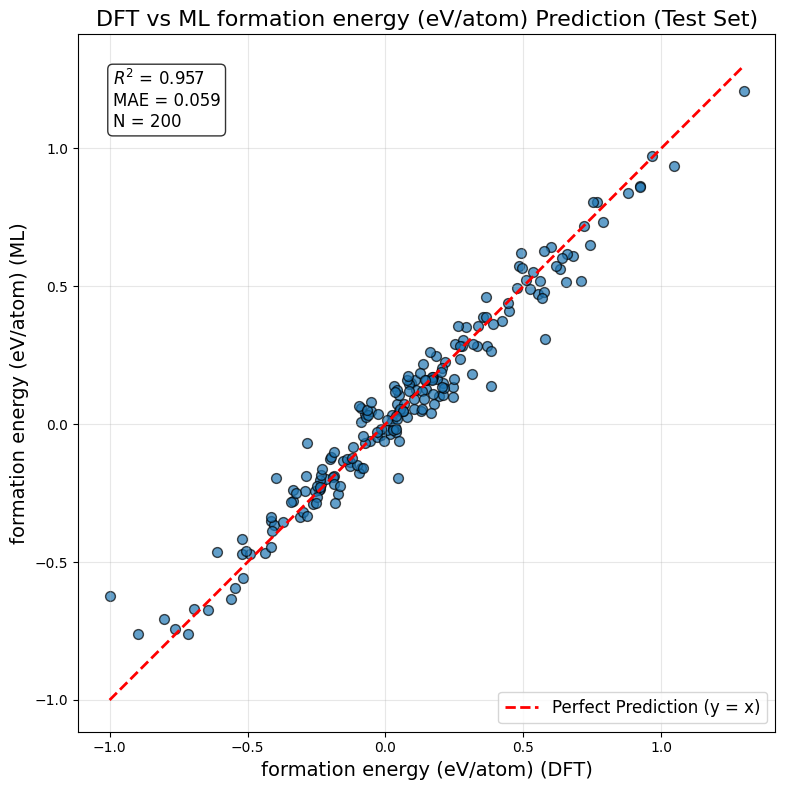
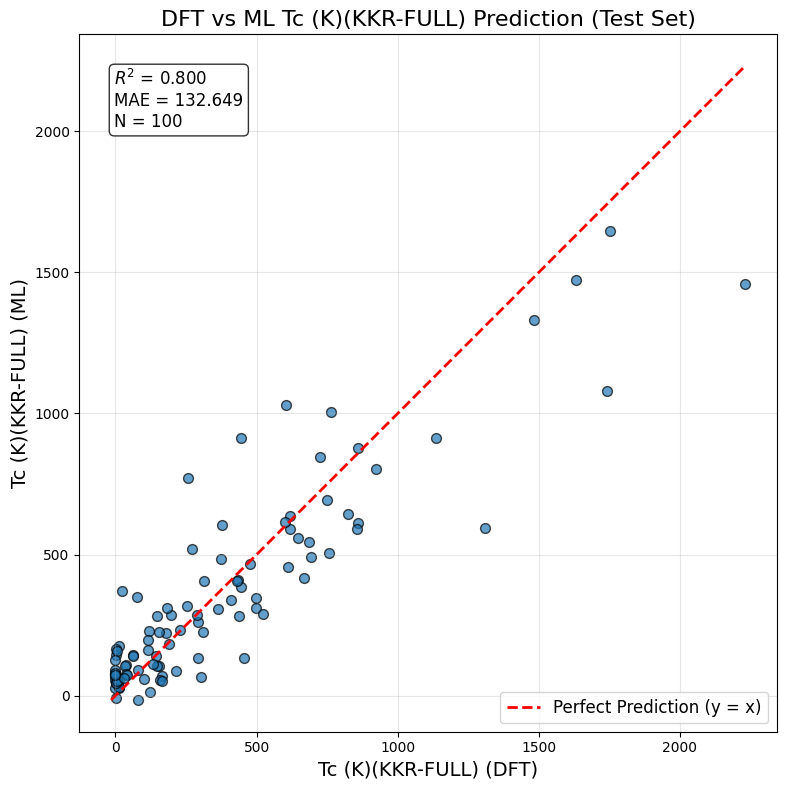

# Frozen Transfer Learning Implementation to FairChem v1 

## Overview

This repository provides modifications and a user-friendly interface to FairChem v1 for **training machine-learning regression model (MLRM) for a property using the eSEN architecture, either from scratch or via transfer learning**. Getting started is straightforward. For training, provide a CSV file containing crystal structures and the target property. For prediction, provide a CSV file containing the crystal structures to evaluate.

A key feature is the implementation of frozen transfer learning (FTL). This approach reuses knowledge in pre-trained models, including universal machine-learning interatomic potential (uMLIP) eSEN-30M-OAM, to develop models for new properties, reducing the amount of training data required while maintaining strong performance. We refer to this repo as `MLIP-FTL`, and distinguish it from our companion package [MLIP-HOT](https://github.com/nims-spin-theory/MLIP_HOT), which directly employs uMLIPs for structure optimization, formation energy, and convex-hull distance calculations.

This implementation and its applications are detailed in our research paper: [arXiv:2508.20556](https://arxiv.org/abs/2508.20556). If you use this code or derive work from it, please cite this paper and FairChem package.


##### Key Features

- **Training and Inference Interface**: A CLI to prepare train/val/test datasets, train regression models, evaluate performance, and run inference (prediction) from CSV inputs.
- **Frozen Transfer Learning**: Transfer knowledge from pre-trained models while keeping the first several layers frozen, preserving learned representations.
- **uMLIP FTL**: Using the universal machine-learning interatomic potential (uMLIP) eSEN-30M-OAM as a base model for enhanced performance.
- **Forked from FairChem v1**: This repository is a modified fork of FairChem v1, based on commit `d4dd224a0c2fdfab6bab550f6cc6463a9c29d48d`.


## Installation

### Prerequisites

Before getting started, please ensure you have the following installed:

- **[Miniconda](https://docs.conda.io/en/latest/miniconda.html)** - For environment management

### Clone Repo

1. **Clone the repository**:

```bash
git clone git@github.com:nims-spin-theory/MLIP_FTL.git
cd MLIP_FTL
```

2. **Set up the environment**:

```bash
# Create and activate the conda environment
# Always activate the environment before use
conda create -n MLIP_FTL python=3.9
conda activate MLIP_FTL
```

### GPU Installation (Recommended)

**Important Note**: This guide assumes CUDA 12.4. If you're using a different CUDA version, please check your version with `nvcc --version` and modify the installation URLs accordingly. Visit the [PyTorch Geometric installation page](https://data.pyg.org/whl/) for compatible combinations.

```bash
# Load CUDA module if managed by your system (optional)
module load cuda/12.4  # Only needed if CUDA is managed by environment modules

# Install PyTorch with CUDA support
pip install torch==2.4.1 torchvision torchaudio --index-url https://download.pytorch.org/whl/cu124

# Install FairChem in development mode
pip install -e packages/fairchem-core[dev]

# Install additional PyTorch dependencies
pip install torch-scatter torch-sparse torch-spline-conv -f https://data.pyg.org/whl/torch-2.4.1+cu124.html
pip install torch-cluster torch_geometric -f https://data.pyg.org/whl/torch-2.4.1+cu124.html

# Install additional dependencies
pip install ase_db_backends
```

### CPU-Only Installation

For systems without GPU support or for testing purposes:

```bash
# Install PyTorch CPU version
pip install torch==2.4.1 torchvision torchaudio --index-url https://download.pytorch.org/whl/cpu

# Install FairChem in development mode
pip install -e packages/fairchem-core[dev]

# Install additional PyTorch dependencies (CPU versions)
pip install torch-scatter torch-sparse torch-spline-conv -f https://data.pyg.org/whl/torch-2.4.1+cpu.html
pip install torch-cluster torch_geometric -f https://data.pyg.org/whl/torch-2.4.1+cpu.html

# Install additional dependencies
pip install ase_db_backends
```


## Usage

This section shows three common workflows using our interface scripts in the `scripts` folder. These examples provide hands-on experience and can be adapted for your research needs. The example data is obtained from the [DXMag Computational HeuslerDB](https://www.nims.go.jp/group/spintheory/database/).

**Workflows Overview:**

1. **Train from scratch**: Build a formation energy model from scratch and use it for predictions
2. **Transfer learning (Model → Model)**: Train a critical temperature model using the formation energy model as base
3. **Transfer learning (eSEN-30M-OAM uMLIP → Model)**: Train a critical temperature model using the pre-trained eSEN-30M-OAM uMLIP as base

First, navigate to the examples folder containing example input CSV files:

```bash
cd examples_scripts
```

#### 1. Dataset Preparation

The `prepare_data.py` script converts a CSV dataset file into the LMDB format. If you copy the examples folder to another location, please update the path to the `prepare_data.py` script accordingly.

```bash
python ../scripts/prepare_data.py  --csv_file database_example_train.csv \
                        --material_id  UUID \
                        --target_property "formation energy (eV/atom)" \
                        --split_ratios 0.8 0.1 0.1
```

The `--csv_file` flag specifies the input CSV file containing the training dataset. The file must include the following columns:

1. **Structure definition columns** (fixed names):
    - **cell**: 3×3 matrix as a list `[[a1,a2,a3], [b1,b2,b3], [c1,c2,c3]]`
    - **positions**: an N×3 matrix as a list containing fractional coordinates `[[atom1x,atom1y,atom1z], [atom2x,atom2y,atom2z]...]`
    - **numbers**:   N‑length list containing atomic numbers `[atom1,atom2,...]` 

2. **Property and identifier columns** (customizable names):
   - Target property column: target property values
   - Material ID column: compound identifiers (formulas, UUIDs, or labels)

Please refer to the example CSV files for the format requirements of structure definition columns.
The target property and material ID column names are arbitrary and should match the values passed to the `--target_property` and `--material_id` flags respectively. 

This will generate a folder that contains the train/val/test dataset for model training and performance evaluation in the next step. In this example, the folder name is `set_formation_energy_(eV_atom)_train`. The output directory can be set using the `--output_dir` flag. Distribution plots are also included in this folder.

For complete information on available parameters, run `python prepare_data.py -h`.

#### 2. Training Formation Energy Model from Scratch

**Single GPU training**
```bash
python ../scripts/MLIP_FTL.py --data_dir "set_formation_energy_(eV_atom)_train" \
                --material_id  UUID \
                --target_property "formation energy (eV/atom)" \
                --num_layers 5 --max_epochs 50
```

**Key Parameters:**
- `--data_dir`: Specifies the data directory created by `prepare_data.py`
- `--num_layers`: Specifies the number of message-passing layers within the model
- `--max_epochs`: Specifies the number of training epochs

The script prints information about the training procedure. The progress (e.g., epoch number) is appended to the log file:
```
Logs are written to: log_train_formation_energy_(eV_atom)_MPL5.txt
```

Upon completion, you'll see:
``` 
==================================================
EVALUATION PHASE
==================================================
Performance Summary for formation energy (eV/atom):
Metric              Value     
------------------------------
R² Score            0.9630
MAE                 0.0520
RMSE                0.0735
Data Points         200

==================================================
TRAINING AND EVALUATION COMPLETED
==================================================
Training and evaluation completed successfully!
Model checkpoint:
    result_formation_energy_(eV_atom)/checkpoints/2026-01-24-14-30-40-formation_energy_(eV_atom)_MPL5/checkpoint.pt
Prediction results of test set:
    result_formation_energy_(eV_atom)/checkpoints/2026-01-24-14-30-40-formation_energy_(eV_atom)_MPL5/performance_formation_energy_(eV_atom).csv
Performance plot:
    result_formation_energy_(eV_atom)/checkpoints/2026-01-24-14-30-40-formation_energy_(eV_atom)_MPL5/performance_formation_energy_(eV_atom).png
```

The trained model checkpoint can then be used to make predictions on new compounds.
Model performance is evaluated on the test set (data not seen during training). A CSV file containing test-set predictions and ground truth values is saved, along with a performance plot visualizing the model's performance. 


For this example, the performance plot is:

<p align="center">
  
</p>

**Multi-GPU training**

```bash
python ../scripts/MLIP_FTL.py --data_dir "set_formation_energy_(eV_atom)_train" \
                --material_id  UUID \
                --target_property "formation energy (eV/atom)" \
                --num_layers 5 --max_epochs 50 \
                --num_gpus 2
```

**CPU-only training**
```bash
python ../scripts/MLIP_FTL.py --data_dir "set_formation_energy_(eV_atom)_train" \
                --material_id  UUID \
                --target_property "formation energy (eV/atom)" \
                --num_layers 5 --max_epochs 50 \
                --cpu_only
```

**Apply the trained model for predictions**:

First, prepare the LMDB file containing the structures for prediction. The `--apply` flag specifies prediction mode. The default output directory is `set_apply`. The output directory can be set using the `--output_dir` flag.

```bash
python ../scripts/prepare_data.py  --csv_file database_example_apply.csv \
                  --material_id  UUID \
                  --apply
```
Then apply the trained model to make predictions:

```bash
python ../scripts/MLIP_FTL.py --apply \
                --model_path "result_formation_energy_(eV_atom)/checkpoints/2025-10-28-19-42-08-formation_energy_(eV_atom)_MPL5/checkpoint.pt" \
                --lmdb_path "set_apply/apply.lmdb" \
                --material_id UUID
```

- `--apply`: Specifies the prediction mode
- `--model_path`: Specifies the path to the trained model checkpoint file
- `--lmdb_path`: Specifies the path to the LMDB file containing compounds for prediction

Upon completion, the script displays the output location. The output directory can also be customized using the `--output_dir` flag.
```
==================================================
PREDICTION COMPLETED
==================================================
The output is stored at:
    "result_formation_energy_(eV_atom)_apply/results/2026-01-24-15-00-32-predict/predict_formation_energy_(eV_atom).csv"
```


##### Tips

**Customizing Output Settings**

You can customize the output directory and job name using the `--output_dir` and `--job_name` flags. If not specified, these will be automatically generated based on the target property name, as demonstrated in the examples above.

**Selecting GPU Device**

If multiple GPUs are available, you can specify which GPU to use with the `--gpu-id` flag. Available GPUs are displayed when script is used.

**Other Available Parameters**

For complete information on available parameters, run:
```
python ../scripts/MLIP_FTL.py -h
```


#### 3. Transfer Learning: Formation Energy → Critical Temperature

First, prepare the dataset for critical temperature training:

```bash
python ../scripts/prepare_data.py  --csv_file database_example_trainTL.csv \
                        --material_id  UUID \
                        --target_property "Tc (K)(KKR-FULL)" \
                        --split_ratios 0.8 0.1 0.1
```

Now train the critical temperature model using transfer learning. Please update the path to your formation energy model checkpoint:

```bash
python ../scripts/MLIP_FTL.py --data_dir "set_Tc_(K)(KKR-FULL)_train" \
                --material_id  UUID \
                --target_property "Tc (K)(KKR-FULL)" \
                --num_layers 5 --max_epochs 100 \
                --transfer_learning \
                --frozen_layers 2 \
                --base_model "result_formation_energy_(eV_atom)/checkpoints/2025-10-28-19-42-08-formation_energy_(eV_atom)_MPL5/checkpoint.pt"
```


**Key Parameters:**
- `--transfer_learning`: Enables transfer learning mode
- `--base_model`: Specifies the path to the base model checkpoint file
- `--frozen_layers`: Specifies the number of frozen layers (layers that remain unchanged during training). Without the `--frozen_layers` flag, all layers are updated during training.


#### 4. Transfer Learning: MLIP → Critical Temperature

**Prerequisites**: This example requires the OMAT24 `eSEN-30M-OAM` MLIP model. Please download `esen_30m_oam.pt` from the [OMAT24 Hugging Face repository](https://huggingface.co/facebook/OMAT24/blob/main/esen_30m_oam.pt) and place it in the examples folder before proceeding.

```bash
python ../scripts/MLIP_FTL.py --data_dir "set_Tc_(K)(KKR-FULL)_train" \
                --material_id  UUID \
                --target_property "Tc (K)(KKR-FULL)" \
                --num_layers 10 --max_epochs 100 \
                --transfer_learning \
                --frozen_layers  7 \
                --base_model "./esen_30m_oam.pt"
```

<p align="center">
    
</p>


## Step-by-Step Explanation of the scripts

The `examples_notebook` contains Jupyter notebooks with step-by-step breakdowns and explanations of the scripts for each workflow introduced above. These notebooks are intended to help users customize the scripts to build pipelines for their research needs.

📁 1. `examples_notebook/1_prepare_dataset/` shows how to convert csv dataset into the FairChem-compatible format required for training.

📁 2. `examples_notebook/2_train_scratch_formE/` shows how to train a formation energy model from scratch and apply it to make predictions.

📁 3. `examples_notebook/3_train_TL_Tc/` shows the breakdown of Transfer Learning: Formation Energy → Critical Temperature

📁 4. `examples_notebook/4_train_TL_Tc_MLIP/` shows the breakdown of Transfer Learning: MLIP → Critical Temperature. Please download the OMAT24 `eSEN-30M-OAM` MLIP model (`esen_30m_oam.pt`) from the [OMAT24 Hugging Face repository](https://huggingface.co/facebook/OMAT24/blob/main/esen_30m_oam.pt) and place it in the examples folder.


## Troubleshooting

### Common Issues and Solutions

#### DistributedDataParallel Error with Frozen Transfer Learning

When using frozen transfer learning, you may encounter the following error:

```bash
[rank0]: RuntimeError: Expected to have finished reduction in the prior iteration before starting a new one. This error indicates that your module has parameters that were not used in producing loss. You can enable unused parameter detection by passing the keyword argument `find_unused_parameters=True` to `torch.nn.parallel.DistributedDataParallel`, and by
[rank0]: making sure all `forward` function outputs participate in calculating loss.
[rank0]: If you already have done the above, then the distributed data parallel module wasn't able to locate the output tensors in the return value of your module's `forward` function. Please include the loss function and the structure of the return value of `forward` of your module when reporting this issue (e.g. list, dict, iterable).
[rank0]: Parameter indices which did not receive grad for rank 0: 0 1 2 3 4 5 6 7 8 9 10 11 12 13 14 15 16 17 18 19 20 21 22 23 24 25 26 27 28 29 30 31 32 33 34 35 36 37 38 39 40
[rank0]: In addition, you can set the environment variable TORCH_DISTRIBUTED_DEBUG to either INFO or DETAIL to print out information about which particular parameters did not receive gradient on this rank as part of this error
```

**Solution**: This error occurs because frozen layers don't participate in gradient computation, causing PyTorch's distributed training to fail. Here's how to fix it:

1. **Locate the PyTorch distributed.py file**:

   The file is located at:

   ```bash
   ~/miniconda3/envs/{conda_env_name}/lib/python3.9/site-packages/torch/nn/parallel/distributed.py
   ```

   For example, if using the `MLIP_FTL` environment from our installation guide:

   ```bash
   ~/miniconda3/envs/MLIP_FTL/lib/python3.9/site-packages/torch/nn/parallel/distributed.py
   ```

2. **Edit the DistributedDataParallel class** (around line 637):

   Change `find_unused_parameters=False` to `find_unused_parameters=True`:

   ```python
   def __init__(
       self,
       module,
       device_ids=None,
       output_device=None,
       dim=0,
       broadcast_buffers=True,
       process_group=None,
       bucket_cap_mb=None,
       find_unused_parameters=True,  # Change from False to True
       check_reduction=False,
       gradient_as_bucket_view=False,
       static_graph=False,
       delay_all_reduce_named_params=None,
       param_to_hook_all_reduce=None,
       mixed_precision: Optional[_MixedPrecision] = None,
       device_mesh=None,
   ):
   ```

## Citation

If you use this code or derive work from it in your research, please cite our paper:

```bibtex
@misc{xiao2026accuratescreeningfunctionalmaterials,
      title={Accurate Screening of Functional Materials with Machine-Learning Potential and Transfer-Learned Regressions: Heusler Alloy Benchmark}, 
      author={Enda Xiao and Terumasa Tadano},
      year={2026},
      eprint={2508.20556},
      archivePrefix={arXiv},
      primaryClass={cond-mat.mtrl-sci},
      url={https://arxiv.org/abs/2508.20556}, 
}
```

And please cite the FairChem paper specified at `https://pypi.org/project/fairchem-core/1.10.0/`:
```bibtex
@article{ocp_dataset,
    author = {Chanussot*, Lowik and Das*, Abhishek and Goyal*, Siddharth and Lavril*, Thibaut and Shuaibi*, Muhammed and Riviere, Morgane and Tran, Kevin and Heras-Domingo, Javier and Ho, Caleb and Hu, Weihua and Palizhati, Aini and Sriram, Anuroop and Wood, Brandon and Yoon, Junwoong and Parikh, Devi and Zitnick, C. Lawrence and Ulissi, Zachary},
    title = {Open Catalyst 2020 (OC20) Dataset and Community Challenges},
    journal = {ACS Catalysis},
    year = {2021},
    doi = {10.1021/acscatal.0c04525},
}
```
and eSEN model paper:
```bibtex
@misc{fu2025learningsmoothexpressiveinteratomic,
      title={Learning Smooth and Expressive Interatomic Potentials for Physical Property Prediction}, 
      author={Xiang Fu and Brandon M. Wood and Luis Barroso-Luque and Daniel S. Levine and Meng Gao and Misko Dzamba and C. Lawrence Zitnick},
      year={2025},
      eprint={2502.12147},
      archivePrefix={arXiv},
      primaryClass={physics.comp-ph},
      url={https://arxiv.org/abs/2502.12147}, 
}
```


## Acknowledgments

- Built on top of the [FairChem](https://github.com/FAIR-Chem/fairchem) framework v1.10.0. Thanks to the FairChem team for providing this powerful framework.


